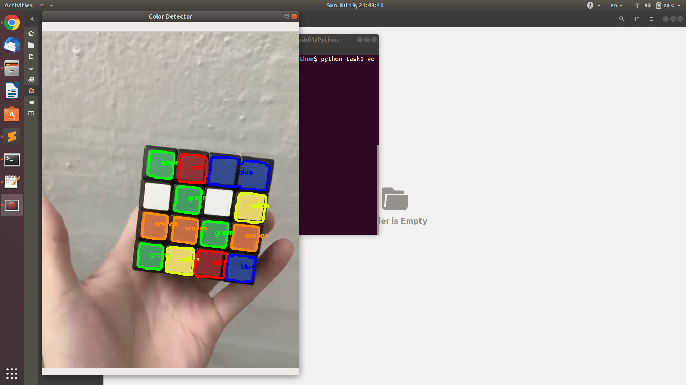

# Color_Detector
### 1. Introduction

Detect 5 colors (red, blue, green, yellow, orange) with OpenCV

### 2. Requirements
Code tested in Python 2.7, OpenCV 3.4.2, Numpy 1.16.6

#### commands for installation of package

$ pip install opencv-python==3.4.2.16 

$ pip install numpy

(did not try on other version of packages but should be fine)

### 3. Running demos

$ python color_detector.py     #detect from webcam

$ python color_detector.py -v [path to video]   #detect from video

Output:

